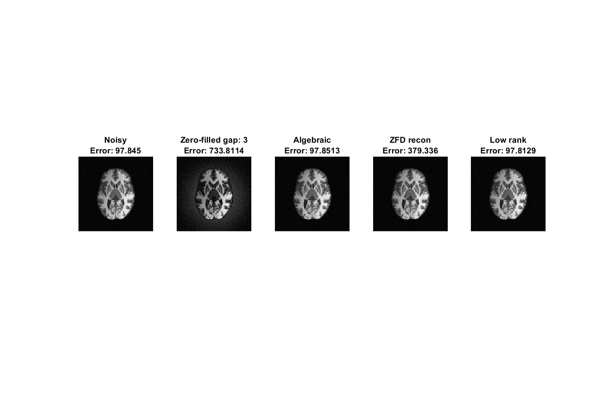
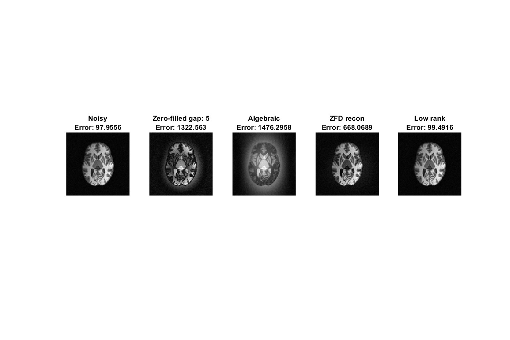

# LRII

# 3D Simulation of ZTE Dead-Time Gap Infilling

## Methods and Dependencies

### Stoch Olejniczak Method
The method can be found [here](https://github.com/curtcorum/missing_points_phase?tab=readme-ov-file). Note that their license prohibits the distribution of any modifications, so the modified code is not included in this repository.

### CG SENSE Method
The CG SENSE method was downloaded from [gpuNUFFT](https://github.com/andyschwarzl/gpuNUFFT). Specifically, the script used is [cg_sense_3d.m](https://github.com/andyschwarzl/gpuNUFFT/blob/350fc322ce0e259efc8b1dfd49e7339163ca7f2f/matlab/demo/utils/cg_sense_3d.m#L4).

### ESPIRiT
You may also need to install BART for ESPIRiT. Installation instructions can be found [here](https://mrirecon.github.io/bart/).

### ZINFANDEL
An implementation of ZINFANDEL is included in this repository. The original version can be found [here](https://github.com/spinicist/riesling).

### Parallel MATLAB Files
Some files from the parallel repository (e.g., `pcgpc`, `pcgL1`, `DWT`) are needed. They can be found [here](https://github.com/marcsous/parallel).

For any issues or questions, feel free to open an issue in this repository.

## Gap size 2, SNR 10

## Gap size 3, SNR 10

